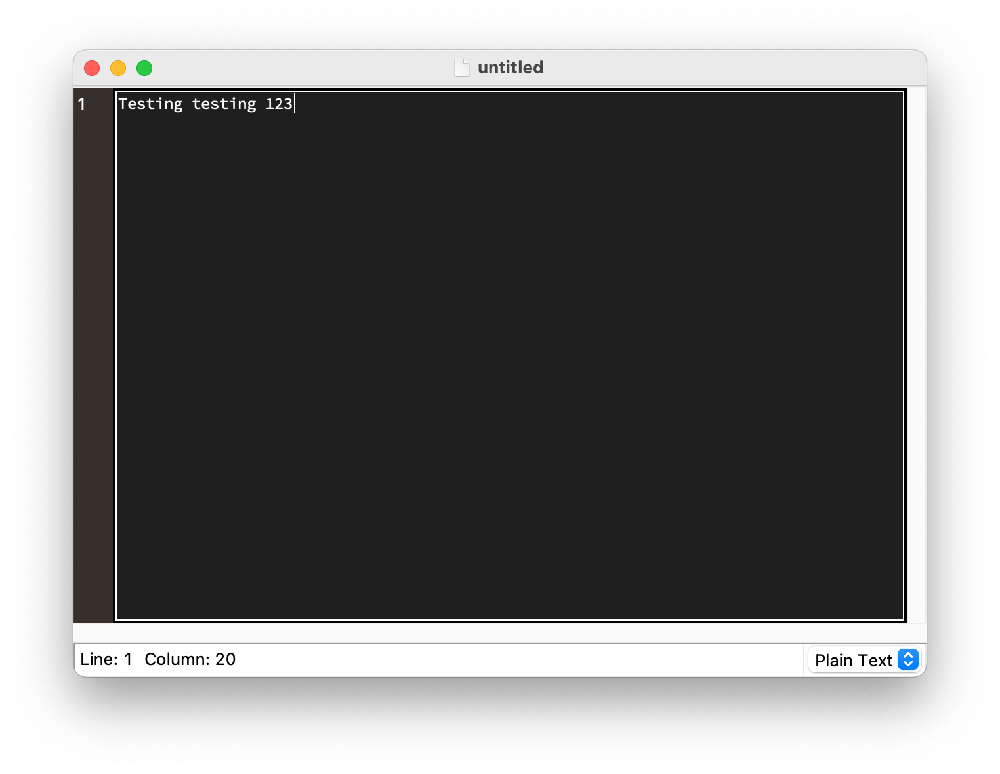
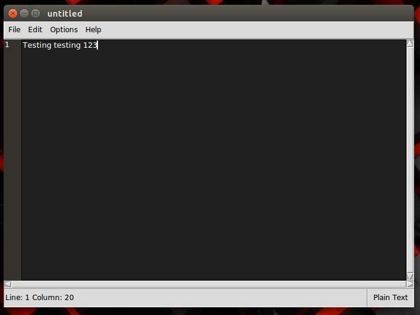
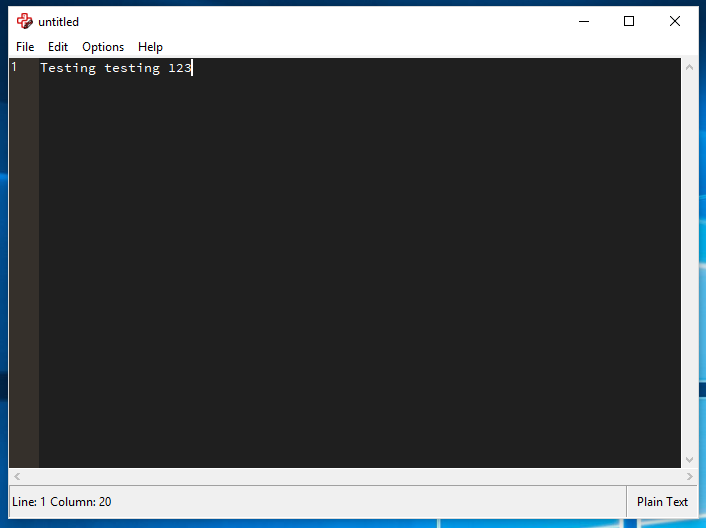

# PyText3

PyText3 is a text editor that was written entirely in Python 3 and includes support for C++, HTML, Java, JavaScript, Python, Swift, and plain text files.

## Features

PyText3 currently supports editing all of the file types listed above. It also includes line numbers, themes, and all of the basic features of any text editor such as file management and cut, copy, and paste.

## Compatibility

PyText3 is compatible with macOS, Linux, and Windows as long as there is a Python 3 interperter installed on the computer. There is also a standalone .app file for macOS that will work even without a python interpreter, and a windows .exe installer file that will install an exe and all of its required files. Most of the features will work with a vanilla install of Python 3 but a few of them will require installation of 3rd party modules. If these modules are not installed, the features will simply not work, but the rest of the editor will still work just fine.

## Dependancies
(To run from the source code)
 - Python 3
 - Pygments (For syntax highlighting NOTE: Not currently supported. Support will be added soon.)

PyText3 also be run on macOS and Windows without a python interpreter using the respective applications for each OS.

## Running the editor
To run PyText3, all you have to do is run the main.py file with a python interpreter installed,

OR

Run the .app file on macOS located in the "dist" folder.

OR

use the windows installer to get a standalone exe with all of the required files in the same directory. The generated exe will not run unless it stays in the same directory as all of the files but does not require the python interpreter to work. The installer exe is also located in the "dist" folder.

## Screenshots
  
MacOS Big Sur
  
  
Ubuntu  
  
  
Windows 10  
  
# Acknowledgments

* [python.org](python.org)
* [stackoverflow.com](stackoverflow.com)
* [pygments.org](pygments.org)
* [TheNewBoston](https://www.youtube.com/user/thenewboston)
* [Brian Oakley](https://stackoverflow.com/users/7432/bryan-oakley)
* [DiogoTheCoder](https://www.youtube.com/channel/UCDDLOEVnBVlAMSbYRzuH-ww)
* [Tech With Tim](https://www.youtube.com/channel/UC4JX40jDee_tINbkjycV4Sg)
